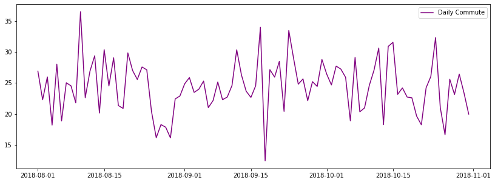
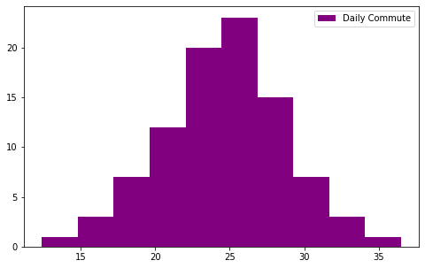
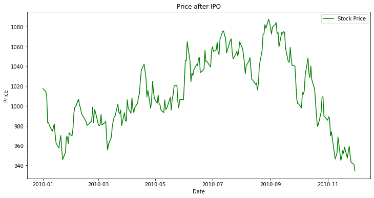
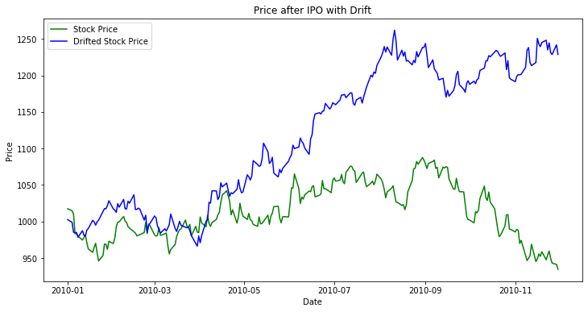
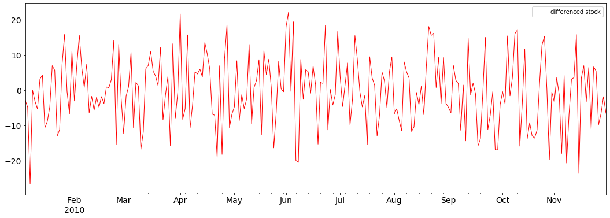
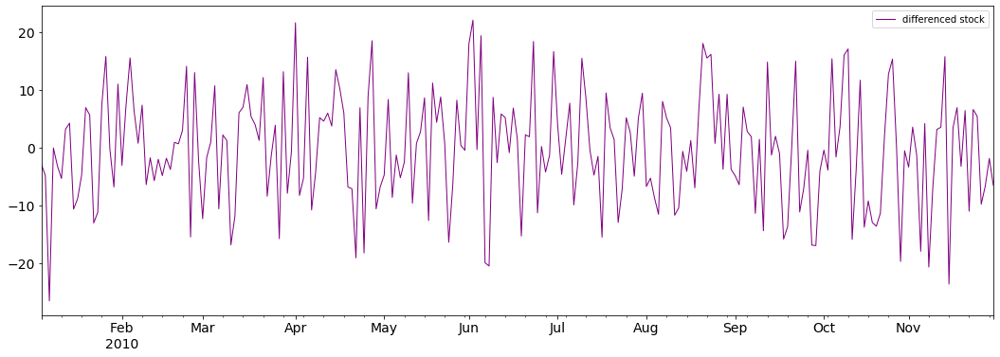

# Basic Time Series Models - Lab

## Introduction

Now that you have an initial understanding of the the White Noise and the Random Walk model, let's try to generate some examples!

## Objectives

You will be able to:
- Explain what the goal is of time series modeling
- Understand and explain what a White Noise model is
- Understand and explain what a Random Walk model is
- Understand the mathematical formulations of Random Walk and White Noise models

## A White Noise Model

To get a good sense of how a model works, it is always a good idea to generate a process. Let's consider the following example:
- Every day in August, September and October 2018, Nina takes the subway to work. Let's ignore weekends for now and assume that Nina works every day.
- We know that on average, it takes her 25 minutes, and the standard deviation is 4 minutes. 
- Create and visualize a time series that reflects this information.

Let's import pandas, numpy and matplotlib.


```python
import pandas as pd
from pandas import Series
import numpy as np
import matplotlib.pyplot as plt 
np.random.seed(12) # do not change this seed.
```

Create the dates. You can do this using `pd.date_range`, more info [here](https://pandas.pydata.org/pandas-docs/stable/generated/pandas.date_range.html).


```python
days = pd.date_range(start='8-01-2018', end='10-31-2018', freq='D')
len(days)
```


    92


Generate the values for the wite noise process representing Nina's commute in August and September.


```python
commute = np.random.normal(loc=25, scale=4, size=92)
commute
```


    array([26.89194333, 22.27429648, 25.96975799, 18.19705746, 28.01257134,
           18.86111464, 25.02050831, 24.51908932, 21.77207249, 36.48727758,
           22.60870832, 26.88982797, 29.38382447, 20.1393248 , 30.36942549,
           24.51140085, 29.05006191, 21.34452341, 20.88187917, 29.8391858 ,
           27.00748922, 25.55538471, 27.56304445, 27.10933066, 20.38255906,
           16.14666608, 18.27297396, 17.847623  , 16.12586022, 22.41027688,
           22.88638272, 24.8431633 , 25.85990379, 23.46256479, 23.98438369,
           25.2930083 , 21.01118465, 22.14457485, 25.14166538, 22.28821854,
           22.71247575, 24.57655074, 30.34332535, 26.27466115, 23.649619  ,
           22.65892689, 24.54032024, 33.96727118, 12.41033391, 27.14054357,
           25.92996176, 28.4704478 , 20.40714914, 33.45737697, 29.00377104,
           24.79434002, 25.63915079, 22.13494565, 25.20209131, 24.42665034,
           28.77430156, 26.4305769 , 24.66620319, 27.71122441, 27.2242415 ,
           25.89087784, 18.88405808, 29.1168447 , 20.33496496, 20.96175339,
           24.57892805, 27.04808863, 30.63091105, 18.24921468, 30.88493597,
           31.54585163, 23.15442026, 24.19455092, 22.71273308, 22.58680354,
           19.64244312, 18.24138832, 24.20269064, 26.03109034, 32.31528286,
           20.99599382, 16.63323515, 25.58623882, 23.13459559, 26.42489203,
           23.40848107, 19.96310594])


Create a time series with the dates and the commute times.


```python
ts = pd.Series(data=commute, index=days)
ts.head()
```


    2018-08-01    26.891943
    2018-08-02    22.274296
    2018-08-03    25.969758
    2018-08-04    18.197057
    2018-08-05    28.012571
    Freq: D, dtype: float64


Visualize the time series and set appropriate axis labels.


```python
fig = plt.figure(figsize=(14,5))
plt.plot(ts, color='purple', label='Daily Commute')
plt.legend(loc='best')
plt.show();
```





Print Nina's shortest and longest commute.


```python
ts.min()
```


    12.41033391382408


```python
ts.max()
```


    36.487277579955666


Look at the distribution of commute times.


```python
fig = plt.figure(figsize=(8,5))
plt.hist(ts, color='purple', label='Daily Commute')
plt.legend(loc='best')
plt.show();
```





Compute the standard deviation and the mean of the commute series. The fact that the mean and standard error are constant over time is crucial!


```python
ts.std()
```


    4.28344328001491


```python
ts.mean()
```


    24.437618956728116


Now, let's look at the mean and standard error for August and October respectively. 


```python
august = ts['8-01-2018':'08-30-2018']
print("Aug Mean:", august.mean())
print("Aug Std:", august.std())
```

    Aug Mean: 24.048168645106614
    Aug Std: 4.801907557977972


```python
october = ts['10-01-2018':'10-31-2018']
print("Oct Mean:", october.mean())
print("Oct std:", october.std())
```

    Oct Mean: 24.302794208974436
    Oct std: 4.148224232744428


Because you've generated this data, you know that the mean and constant will be the same over time. But comparing mean and standard deviation over time is useful practice for real data examples to check if a process is White Noise!

## A Random Walk Model

Remember from the lecture that the Random Walk Model:

- Has no specified mean or variance
- Has a strong dependence over time

Mathematically, this can be written as:

$$Y_t = Y_{t-1} + \epsilon_t$$

Because today's value depends on yesterday's, you need a starting value when you start off your time series. In practice, this is what the first few time series values look like:
$$ Y_0 = \text{some specified starting value}$$
$$Y_1= Y_{0}+ \epsilon_1 $$
$$Y_2= Y_{1}+ \epsilon_2 = Y_{0} + \epsilon_1 + \epsilon_2  $$
$$Y_3= Y_{2}+ \epsilon_3 = Y_{0} + \epsilon_1 + \epsilon_2 + \epsilon_3 $$
$$\ldots $$

Keeping this in mind, let's create a random walk model:
- starting from a value of 1000 USD of a share value upon a company's first IPO (initial public offering) in 2010 until end of November of the same year, generate a random walk model with a white noise error term, which has a standard error of 10.


```python
# keep the random seed
np.random.seed(11)

# create a series with the specified dates
date = pd.date_range(start='1-01-2010', end='11-30-2010', freq='B')
date
```


    DatetimeIndex(['2010-01-01', '2010-01-04', '2010-01-05', '2010-01-06',
                   '2010-01-07', '2010-01-08', '2010-01-11', '2010-01-12',
                   '2010-01-13', '2010-01-14',
                   ...
                   '2010-11-17', '2010-11-18', '2010-11-19', '2010-11-22',
                   '2010-11-23', '2010-11-24', '2010-11-25', '2010-11-26',
                   '2010-11-29', '2010-11-30'],
                  dtype='datetime64[ns]', length=238, freq='B')


```python
# White noise error term
error = np.random.normal(0, 10, len(date))

# Define random walk
def random_walk(start, error):        
    Y_0 = start
    cum_error = np.cumsum(error)
    Y = cum_error + Y_0 
    return Y

stock = random_walk(1000, error)

stock_value = pd.Series(stock, index=date)
```

Visualize the time series with correct axis labels


```python
fig = plt.figure(figsize=(12,6))
ax = fig.gca()
ax.plot(stock_value, color='green', label='Stock Price')
ax.legend(loc='best')
ax.set_xlabel('Date')
ax.set_ylabel('Price')
ax.set_title('Price after IPO')
```


    Text(0.5, 1.0, 'Price after IPO')





You can see how this very much looks like the exchange rate series you looked at in the lecture!

## Random Walk with a Drift

Repeat the above, but include a drift parameter $c$ of 8 now!


```python
# keep the random seed

# Define random walk
def drift_random_walk(start, error):        
    Y_0 = start
    cum_error = np.cumsum(error)
    c = 8
    Y = c + cum_error + Y_0 
    return Y

stock_drift = drift_random_walk(1000, error)

drifted_value = pd.Series(stock_drift, index=date)
```


```python
fig = plt.figure(figsize=(12,6))
ax = fig.gca()
ax.plot(stock_value, color='green', label='Stock Price')
ax.plot(drifted_share, color='blue', label='Drifted Stock Price')
ax.legend(loc='best')
ax.set_xlabel('Date')
ax.set_ylabel('Price')
ax.set_title('Price after IPO with Drift')
```


    Text(0.5, 1.0, 'Price after IPO with Drift')





Note that there is a very strong drift here!

## Differencing in a Random Walk model

One important property of the Random Walk model is that a differenced random walk returns a white noise. This is a result of the mathematical formula:

$$Y_t = Y_{t-1} + \epsilon_t$$
which is equivalent to
$$Y_t - Y_{t-1} = \epsilon_t$$

and we know that $\epsilon_t$ is a mean-zero white noise process! 

Plot the differenced time series for the shares time series (no drift).


```python
stock_diff = stock_value.diff(periods=1)
stock_diff
```


    2010-01-01          NaN
    2010-01-04    -2.860730
    2010-01-05    -4.845651
    2010-01-06   -26.533186
    2010-01-07    -0.082846
                    ...    
    2010-11-24     5.382152
    2010-11-25    -9.816297
    2010-11-26    -6.666398
    2010-11-29    -1.898239
    2010-11-30    -6.560854
    Freq: B, Length: 238, dtype: float64


```python
stock_diff.dropna(inplace=True)
```


```python
stock_diff.plot(figsize=(18,6), color='red', linewidth=1, fontsize=14, label="differenced stock")
plt.xlabel=('Date')
plt.ylabel=('Differenced Stock Price')
#plt.title=('Difference Stock Value')
plt.legend(loc='best')
```


    <matplotlib.legend.Legend at 0x120a0aba8>





This does look a lot like a white noise series!

Plot the differenced time series for the shares time series (with a drift).


```python
drift_diff = drifted_value.diff(periods=1)
```


```python
drift_diff.dropna(inplace=True)
```


```python
drift_diff.plot(figsize=(18,6), color='purple', linewidth=1, fontsize=14, label="differenced stock")
plt.xlabel=('Date')
plt.ylabel=('Differenced Stock Price')
#plt.title=('Difference Stock Value')
plt.legend(loc='best')
```


    <matplotlib.legend.Legend at 0x120ddeeb8>





This is also a white noise series, but what can you tell about the mean?

The mean is equal to the drift $c$, so 8 for this example!

## Summary

Great, you now know how a Random Walk and Moving Average model work!
